# Backend ↔ Frontend Wire-Up Audit

**Date:** 2026-07-06
**Scope:** Full audit of what is wired up vs. what is NOT wired up between [`apps/api`](apps/api) (NestJS + GraphQL + TypeORM) and [`apps/web`](apps/web) (Next.js + Apollo Client).

---

## 1. Executive Summary

The codebase has a **mature auth layer** that is fully wired end-to-end, a **partially wired CRM/Operations layer** (leads, events, meeting rooms, requests), and a **large set of pages still running on hardcoded mock data**. The biggest gaps are:

1. **No Customer resolver exists in the API** — yet the web app has full CRUD operations for customers.
2. **Dashboard home page** uses hardcoded stats and `Demo` components — no live data.
3. **Revenue pages** (invoices, deposits, contracts) are 100% mock data despite having both API resolvers AND web operations defined.
4. **Inventory, Reports, Settings, Notifications** pages are entirely mock/static.
5. The [`schema.graphql`](apps/api/src/graphql/schema.graphql) file is stale (188 lines) and does not reflect the code-first NestJS schema.

---

## 2. What IS Wired Up ✅

### 2.1 Authentication (FULLY WIRED)
| Layer | Status | Files |
|-------|--------|-------|
| API resolvers | ✅ Complete | [`auth.resolver.ts`](apps/api/src/graphql/resolvers/auth.resolver.ts) |
| API services | ✅ Complete | [`auth.service.ts`](apps/api/src/auth/services/auth.service.ts), 2FA, lockout, email, password-policy |
| Web operations | ✅ Complete | [`operations.ts`](apps/web/src/lib/apollo/operations.ts) — signin, signup, verifyEmail, 2FA, magic-link, password reset, change password, recovery codes |
| Web context | ✅ Complete | [`auth-context.tsx`](apps/web/src/contexts/auth-context.tsx) — all mutations wired to Apollo |
| Web pages | ✅ Complete | signin, signup, verify-email, forgot-password, reset-password, magic-link pages all exist |

### 2.2 CRM — Leads (PARTIALLY WIRED)
| Layer | Status | Notes |
|-------|--------|-------|
| API resolver | ✅ | [`crm.resolver.ts`](apps/api/src/graphql/resolvers/crm.resolver.ts) — leads CRUD, convertLead, leadCount |
| Web operations | ✅ | GET_LEADS, CREATE_LEAD, UPDATE_LEAD, CONVERT_LEAD, DELETE_LEAD, LEAD_COUNT |
| Web page | ⚠️ Partial | [`leads/page.tsx`](apps/web/src/app/dashboard/crm/leads/page.tsx) uses Apollo with **mock fallback** (`MOCK_LEADS`). UPDATE_LEAD and DELETE_LEAD are commented out. Pipeline stats are hardcoded. |

### 2.3 Operations — Meeting Rooms (WIRED)
| Layer | Status | Notes |
|-------|--------|-------|
| API resolver | ✅ | [`meeting-room.resolver.ts`](apps/api/src/graphql/resolvers/meeting-room.resolver.ts) |
| Web hooks | ✅ | [`use-operations.ts`](apps/web/src/hooks/use-operations.ts) — full hooks for rooms, availability, booking, CRUD |

### 2.4 Operations — Events (WIRED)
| Layer | Status | Notes |
|-------|--------|-------|
| API resolver | ✅ | [`event.resolver.ts`](apps/api/src/graphql/resolvers/event.resolver.ts) |
| Web hooks | ✅ | [`use-operations.ts`](apps/web/src/hooks/use-operations.ts) — events CRUD, stats, status updates |

### 2.5 Operations — Requests (WIRED)
| Layer | Status | Notes |
|-------|--------|-------|
| API resolver | ✅ | [`request.resolver.ts`](apps/api/src/graphql/resolvers/request.resolver.ts) |
| Web hooks | ✅ | [`use-operations.ts`](apps/web/src/hooks/use-operations.ts) — requests CRUD, assign, complete, reject, cancel |

### 2.6 Centers / Locations / Floors / Seats (API EXISTS, WEB NOT WIRED)
| Layer | Status | Notes |
|-------|--------|-------|
| API resolver | ✅ | [`center.resolver.ts`](apps/api/src/graphql/resolvers/center.resolver.ts) |
| Web operations | ❌ | No operations defined in [`operations.ts`](apps/web/src/lib/apollo/operations.ts) for centers/locations/floors/seats |

---

## 3. What is NOT Wired Up ❌

### 3.1 CRITICAL: Customer Module — No Backend
The web app defines full CRUD operations in [`operations.ts`](apps/web/src/lib/apollo/operations.ts) (lines 610-684):
- `GET_CUSTOMERS`, `GET_CUSTOMER`, `CREATE_CUSTOMER`, `UPDATE_CUSTOMER`, `DELETE_CUSTOMER`

**But there is NO customer resolver in the API.** The revenue resolvers reference `relations: ['customer', 'center']` but no `Customer` entity or resolver exists in [`apps/api/src/graphql/resolvers/`](apps/api/src/graphql/resolvers/). The [`customers/page.tsx`](apps/web/src/app/dashboard/crm/customers/page.tsx) uses 100% hardcoded `customersData`.

### 3.2 Dashboard Home — Hardcoded Stats
[`dashboard/page.tsx`](apps/web/src/app/dashboard/page.tsx) and [`dashboard/home/page.tsx`](apps/web/src/app/dashboard/home/page.tsx):
- KPI cards: hardcoded values (`₹9.8L`, `20`, `₹6.2L`, `3`)
- All dashboard widgets use `Demo` suffixed components (e.g. `TotalLeadCardDemo`, `ApprovalQueueCardDemo`)
- No Apollo queries, no `useQuery` calls
- The API has [`dashboardMetrics`](apps/api/src/graphql/resolvers/analytics.resolver.ts) query available but it's never called from the web app

### 3.3 Revenue — Invoices (Mock Data)
[`revenue/invoices/page.tsx`](apps/web/src/app/dashboard/revenue/invoices/page.tsx):
- Uses `mockInvoices` array (4 hardcoded rows)
- No Apollo imports, no `useQuery`
- Web operations `GET_INVOICES`, `CREATE_INVOICE`, etc. exist but are **never imported or used**
- API resolver [`InvoiceResolver`](apps/api/src/graphql/resolvers/revenue.resolver.ts) is fully functional

### 3.4 Revenue — Deposits (Mock Data)
[`revenue/deposits/page.tsx`](apps/web/src/app/dashboard/revenue/deposits/page.tsx):
- Uses `mockDeposits` and `mockActivities` arrays
- No Apollo imports
- Web operations `GET_DEPOSITS`, `CREATE_DEPOSIT`, `RELEASE_DEPOSIT`, etc. exist but are **never used**
- API resolver `DepositResolver` is fully functional

### 3.5 Revenue — Contracts (Mock Data)
[`revenue/contracts/page.tsx`](apps/web/src/app/dashboard/revenue/contracts/page.tsx):
- Inline hardcoded table rows (9 rows defined in JSX)
- No Apollo imports
- Web operations `GET_CONTRACTS`, `CREATE_CONTRACT`, `TERMINATE_CONTRACT` exist but are **never used**
- API resolver `ContractResolver` is fully functional

### 3.6 Inventory (Mock Data)
[`inventory/table-view/page.tsx`](apps/web/src/app/dashboard/inventory/table-view/page.tsx):
- Uses `inventoryData` hardcoded array
- No Apollo imports
- API has floors/seats resolvers but no web operations exist for them

### 3.7 Reports (Mock Data)
[`report/overview/page.tsx`](apps/web/src/app/dashboard/report/overview/page.tsx):
- `revenueCards` and `recentTransactions` are hardcoded
- API has `revenueReport` and `occupancyReport` queries but they're never called from web

### 3.8 Settings (Mock Data)
[`settings/center/page.tsx`](apps/web/src/app/dashboard/settings/center/page.tsx):
- 587 lines, all static form data
- No Apollo calls to `centers`, `updateCenter`, etc.

### 3.9 Notifications (Mock Data)
[`notifications/page.tsx`](apps/web/src/app/dashboard/notifications/page.tsx):
- 548 lines, all static
- No real-time subscriptions wired (API has PubSub for `bookingUpdated`, `paymentStatusChanged`)

### 3.10 Stale Schema File
[`schema.graphql`](apps/api/src/graphql/schema.graphql) is 188 lines and only covers the original schema (users, centers, bookings, analytics). It does NOT include:
- CRM types (Lead, LeadStatus, LeadFiltersInput)
- Revenue types (Invoice, Deposit, Contract and their inputs)
- Event/MeetingRoom/Request types
- Auth types (SigninInput, SignupInput, AuthPayload with 2FA fields)

This file appears to be a leftover from schema-first development; the API is now code-first (NestJS decorators).

---

## 4. Gap Matrix

| Feature | API Resolver | Web Operations | Web Page Wired | Status |
|---------|:---:|:---:|:---:|--------|
| Auth (signin/signup/2FA/magic-link) | ✅ | ✅ | ✅ | **Complete** |
| Leads (CRUD + convert) | ✅ | ✅ | ⚠️ Partial | Mock fallback, update/delete commented out |
| Customers (CRUD) | ❌ | ✅ | ❌ | **No backend** |
| Invoices (CRUD + markPaid) | ✅ | ✅ | ❌ | **Mock data only** |
| Deposits (CRUD + release) | ✅ | ✅ | ❌ | **Mock data only** |
| Contracts (CRUD + terminate) | ✅ | ✅ | ❌ | **Mock data only** |
| Meeting Rooms (CRUD + book) | ✅ | ✅ | ✅ | **Complete** |
| Events (CRUD + stats) | ✅ | ✅ | ✅ | **Complete** |
| Requests (CRUD + workflow) | ✅ | ✅ | ✅ | **Complete** |
| Dashboard metrics | ✅ | ❌ | ❌ | **Not wired** |
| Revenue report | ✅ | ❌ | ❌ | **Not wired** |
| Occupancy report | ✅ | ❌ | ❌ | **Not wired** |
| Centers/Locations/Floors/Seats | ✅ | ❌ | ❌ | **Not wired** |
| Inventory (seats/floors) | ✅ | ❌ | ❌ | **Not wired** |
| Settings (center mgmt) | ✅ | ❌ | ❌ | **Not wired** |
| Notifications (subscriptions) | ✅ | ❌ | ❌ | **Not wired** |

---

## 5. Recommended Wire-Up Plan

### Phase 1: Build Missing Backend (Customer Module)
1. Create `Customer` entity in [`apps/api/src/typeorm/entities/`](apps/api/src/typeorm/entities/)
2. Create customer input types in [`apps/api/src/graphql/inputs/`](apps/api/src/graphql/inputs/)
3. Create [`customer.resolver.ts`](apps/api/src/graphql/resolvers/) with full CRUD
4. Register in CRM module
5. Run migration / sync schema

### Phase 2: Wire Revenue Pages to Live Data
6. Wire [`invoices/page.tsx`](apps/web/src/app/dashboard/revenue/invoices/page.tsx) to `GET_INVOICES`, `CREATE_INVOICE`, `UPDATE_INVOICE`, `DELETE_INVOICE`, `MARK_INVOICE_PAID`
7. Wire [`deposits/page.tsx`](apps/web/src/app/dashboard/revenue/deposits/page.tsx) to `GET_DEPOSITS`, `CREATE_DEPOSIT`, `RELEASE_DEPOSIT`, `DELETE_DEPOSIT`
8. Wire [`contracts/page.tsx`](apps/web/src/app/dashboard/revenue/contracts/page.tsx) to `GET_CONTRACTS`, `CREATE_CONTRACT`, `UPDATE_CONTRACT`, `TERMINATE_CONTRACT`

### Phase 3: Wire CRM Customers Page
9. Wire [`customers/page.tsx`](apps/web/src/app/dashboard/crm/customers/page.tsx) to `GET_CUSTOMERS`, `CREATE_CUSTOMER`, `UPDATE_CUSTOMER`, `DELETE_CUSTOMER` (after Phase 1 backend is ready)

### Phase 4: Wire Dashboard to Live Metrics
10. Add `DASHBOARD_METRICS` query to [`operations.ts`](apps/web/src/lib/apollo/operations.ts)
11. Replace hardcoded stats in [`dashboard/page.tsx`](apps/web/src/app/dashboard/page.tsx) with live `dashboardMetrics` query
12. Wire dashboard widgets (TotalLeadCard, PaymentHealthCard, etc.) to live data instead of `Demo` variants

### Phase 5: Wire Reports
13. Add `REVENUE_REPORT` and `OCCUPANCY_REPORT` queries to operations
14. Wire [`report/overview/page.tsx`](apps/web/src/app/dashboard/report/overview/page.tsx) and [`report/revenue/page.tsx`](apps/web/src/app/dashboard/report/revenue/page.tsx) to live data

### Phase 6: Wire Inventory & Settings
15. Add center/floor/seat operations to [`operations.ts`](apps/web/src/lib/apollo/operations.ts)
16. Wire [`inventory/table-view/page.tsx`](apps/web/src/app/dashboard/inventory/table-view/page.tsx) to seats/floors queries
17. Wire [`settings/center/page.tsx`](apps/web/src/app/dashboard/settings/center/page.tsx) to `centers`, `updateCenter` mutations

### Phase 7: Finish Leads Page
18. Uncomment and wire `UPDATE_LEAD` and `DELETE_LEAD` mutations in [`leads/page.tsx`](apps/web/src/app/dashboard/crm/leads/page.tsx)
19. Replace hardcoded pipeline stats with `LEAD_COUNT` query

### Phase 8: Cleanup
20. Delete or regenerate stale [`schema.graphql`](apps/api/src/graphql/schema.graphql)
21. Remove mock data files once all pages are wired

---

## 6. Architecture Diagram

```mermaid
flowchart TB
    subgraph API["apps/api - NestJS GraphQL"]
        AuthR[Auth Resolver]
        CrmR[CRM Resolver - Leads]
        RevR[Revenue Resolvers - Invoices, Deposits, Contracts]
        OpsR[Operations Resolvers - Events, MeetingRooms, Requests]
        CenterR[Center Resolver - Centers, Floors, Seats]
        AnalyticsR[Analytics Resolver - Dashboard, Revenue, Occupancy]
        CustomerR[Customer Resolver - MISSING]
    end

    subgraph Web["apps/web - Next.js + Apollo"]
        AuthCtx[Auth Context - WIRED]
        OpsHook[use-operations Hook - WIRED]
        LeadsPage[Leads Page - PARTIAL]
        CustomersPage[Customers Page - MOCK]
        InvoicesPage[Invoices Page - MOCK]
        DepositsPage[Deposits Page - MOCK]
        ContractsPage[Contracts Page - MOCK]
        DashboardPage[Dashboard Home - MOCK]
        ReportsPage[Reports - MOCK]
        InventoryPage[Inventory - MOCK]
        SettingsPage[Settings - MOCK]
    end

    AuthR -->|fully wired| AuthCtx
    OpsR -->|fully wired| OpsHook
    CrmR -->|partial, mock fallback| LeadsPage
    RevR -.->|operations exist, not used| InvoicesPage
    RevR -.->|operations exist, not used| DepositsPage
    RevR -.->|operations exist, not used| ContractsPage
    CustomerR -.->|backend missing| CustomersPage
    AnalyticsR -.->|not wired| DashboardPage
    AnalyticsR -.->|not wired| ReportsPage
    CenterR -.->|not wired| InventoryPage
    CenterR -.->|not wired| SettingsPage

    style CustomerR fill:#ff6b6b,color:#fff
    style CustomersPage fill:#ffd93d
    style InvoicesPage fill:#ffd93d
    style DepositsPage fill:#ffd93d
    style ContractsPage fill:#ffd93d
    style DashboardPage fill:#ffd93d
    style ReportsPage fill:#ffd93d
    style InventoryPage fill:#ffd93d
    style SettingsPage fill:#ffd93d
    style LeadsPage fill:#f9ca24
```

**Legend:** Green = wired, Yellow = mock data, Red = missing backend, Dashed = not connected
